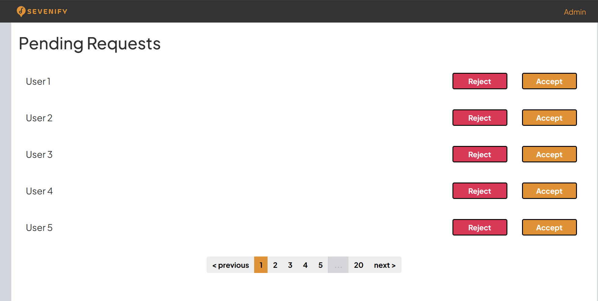
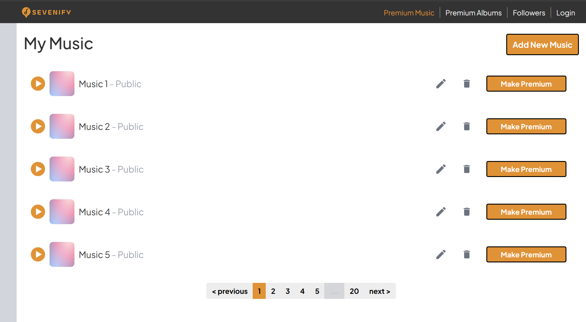
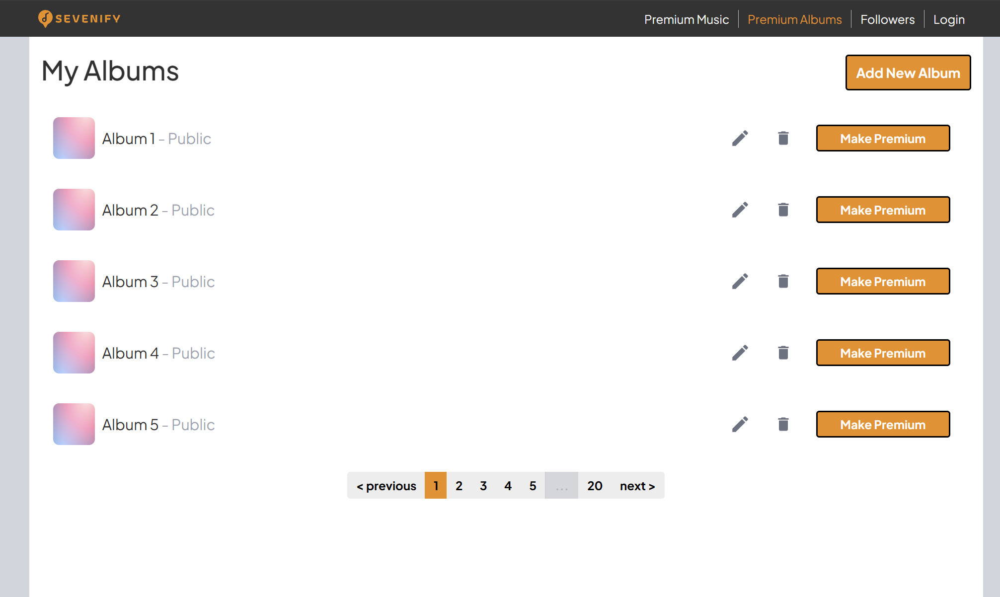
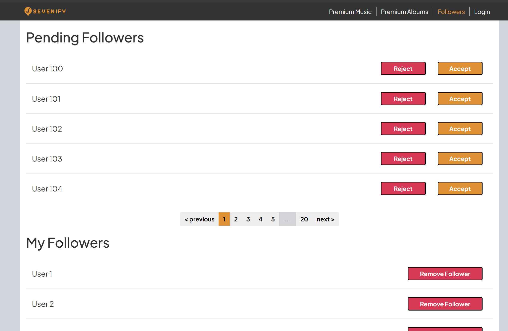

# Sevenify - Client SPA

## Deskripsi Aplikasi
Sevenify merupakan perangkat lunak pemutar musik berbasis web. Aplikasi ini dilengkapi dengan fitur pemutar musik, pencarian lagu, serta album. Tidak hanya mendengarkan musik, pengguna juga dapat mengunggah musik maupun membuat album sendiri. Pengguna dapat bergabung dengan Sevenify+ untuk dapat mengunggah lagu-lagu premium yang hanya dapat diakses pengguna tertentu. Pengguna juga dapat mengikuti atau follow pengguna lain untuk dapat mendengarkan lagu premium milik pengguna lain. Admin dapat melakukan modifikasi data musik, album, serta memodifikasi akun pada aplikasi. Dengan desain tampilan yang sederhana, aplikasi ini diharapkan dapat digunakan dengan mudah oleh pengguna. Mari nikmati musik bersama Sevenify, Feel the Beat Live the Melody!

## Prerequisites
- Node.js, untuk menjalankan JavaScript dan npm packages.

## Cara Instalasi
1. Pastikan _requirements_ sudah terinstall pada perangkat Anda
2. Buka terminal
3. Lakukan clone repository ini : `git clone https://github.com/Rinaldy-Adin/sevenify-spa.git`
4. Pindah ke directory repository: `cd sevenify-spa`
5. Install dependencies project dengan npm: `npm install`
6. Jalankan development server dan React dengan command: `npm run dev`

## Tangkapan Layar
- Halaman Admin

- Halaman Musik

- Halaman Album

- Halaman Followers

- Halaman Login

- Halaman Join

## Pembagian Tugas
FrontEnd Halaman Admin : 13521134  
FrontEnd Halaman Musik : 13521134  
FrontEnd Halaman Album : 13521134  
FrontEnd Halaman Followers : 13521134  
FrontEnd Halaman Login : 10023174  
FrontEnd Halaman Join : 13521077  

## Kontributor
10023174 Ilham Syam 
13521077 Husnia Munzayana 
13521134 Rinaldy Adin 
